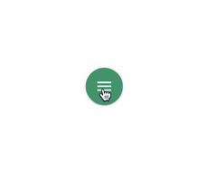
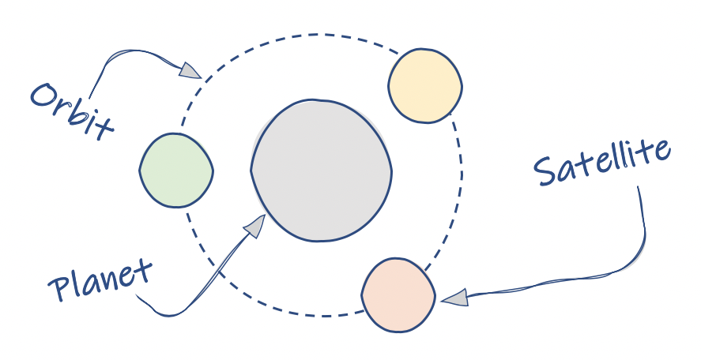
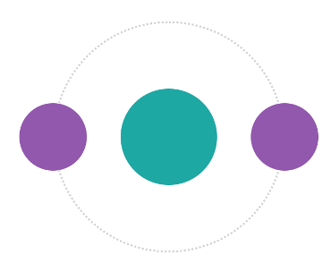
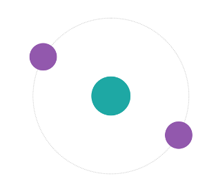
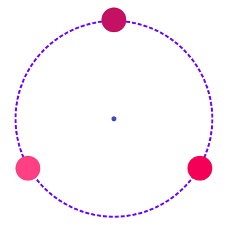
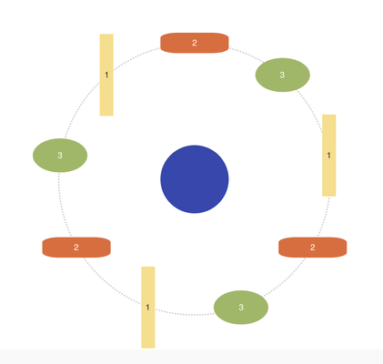
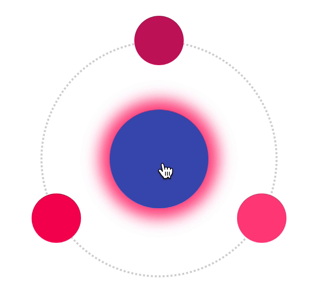
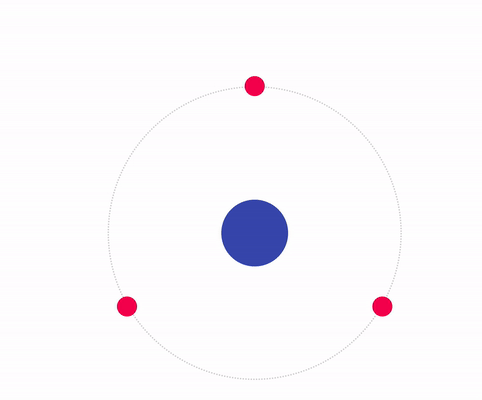
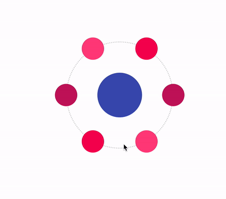

# react-planet

[](https://www.npmjs.com/package/react-planet)
[](https://www.npmjs.com/package/react-planet)
<br />
<br />
A react lib for building circular menus in a very easy and handy way.



Live-Demo: [STORYBOOK](https://innfactory.github.io/react-planet)

Read the full story @ [Medium](https://medium.com/@innFactory/creating-circular-menus-with-react-planet-8c7c9df6d766) or [innFactory-Blog](https://innfactory.de/softwareentwicklung/ui-ux/creating-circular-menus-with-react-planet/)

## install

```
npm install --save react-planet
```

## Concept



## Basic Example



```jsx
import { Planet } from 'react-planet';

export function MyPlanet() {
	return (
		<Planet
			centerContent={
				<div
					style={{
						height: 100,
						width: 100,
						borderRadius: '50%',
						backgroundColor: '#1da8a4',
					}}
				/>
			}
			open
			autoClose
		>
			<div
				style={{
					height: 70,
					width: 70,
					borderRadius: '50%',
					backgroundColor: '#9257ad',
				}}
			/>
			<div
				style={{
					height: 70,
					width: 70,
					borderRadius: '50%',
					backgroundColor: '#9257ad',
				}}
			/>
		</Planet>
	);
}
```

## Change the orbit



```jsx
<Planet centerContent={div style={...yourStlye}/>}
        open
        orbitRadius={120}
        rotation={30}
        ...
>
```

## Orbit Style



```jsx
<Planet
	orbitStyle={(defaultStyle) => ({
		...defaultStyle,
		borderWidth: 4,
		borderStyle: 'dashed',
		borderColor: '#6f03fc',
	})}
	centerContent={<div className={classes.planetSmall} />}
	open
>
	<div className={classes.satellite1} />
	<div className={classes.satellite2} />
	<div className={classes.satellite3} />
</Planet>
```

## Weird satellites and their orientation



```jsx
<Planet
    // set one of the orientations
    satelliteOrientation="INSIDE"

```

## Bring it to life



```jsx
<Planet
    dragablePlanet
    dragRadiusPlanet={20}
    bounce
```

## Planetception

Nested planets



Code: [/src/stories/Planet.stories.tsx](/src/stories/Planet.stories.tsx)

## Fake the space


```jsx
<Planet
	centerContent={<YourButton0 />}
	hideOrbit
	autoClose
	orbitRadius={60}
	bounceOnClose
	rotation={105}
	// the bounce direction is minimal visible
	// but on close it seems the button wobbling a bit to the bottom
	bounceDirection="BOTTOM"
>
	<YourButton1 />
	<YourButton2 />
	<YourButton3 />
	<div />
	<div />
	<div />
	<div />
</Planet>
```

## Alter the physics



```jsx
<Planet
      mass={4}
      tension={500}
      friction={19}

```

<br/>

# Props

| name                 | type                                    | example /default         | description                                                    |
| -------------------- | --------------------------------------- | ------------------------ | -------------------------------------------------------------- |
| centerContent        | React.Node?                             | <div />                  | The planet component                                           |
| orbitRadius          | number?                                 | 120                      | How far the satellites are away from the planet                |
| open                 | boolean?                                | false                    | Set the open/close state from outside                          |
| autoClose            | boolean?                                | false                    | If true the planet handles the open/close state by itself      |
| hideOrbit            | boolean?                                | false                    | If true the orbit is hidden / not rendered                     |
| rotation             | number?                                 | 0                        | The angle for the rotation of all satellites around the planet |
| satelliteOrientation | DEFAULT INSIDE OUTSIDE READABLE         | undefined / DEFAULT      | The angle for the rotation of one satellite itself             |
| dragableSatellites   | boolean?                                | false                    | If true you can click and drag a satellite                     |
| dragRadiusSatellites | number?                                 | 12                       | Defines how much you can drag the satellites                   |
| dragablePlanet       | boolean?                                | false                    | If true you can click and drag the planet                      |
| dragRadiusPlanet     | number?                                 | 12                       | Defines how much you can drag the planet                       |
| bounce               | boolean?                                | false                    | If true the planet bounces on open and close                   |
| bounceOnOpen         | boolean?                                | false                    | If true the planet bounces only on open                        |
| bounceOnClose        | boolean?                                | false                    | If true the planet bounces only on close                       |
| bounceRadius         | number?                                 | 3                        | Defines how much the planet bounces                            |
| bounceDirection      | TOP BOTTOM LEFT RIGHT                   | undefined                | On hight bounceRadius you can see a direction                  |
| tension              | number?                                 | 500                      | a react-spring animation physic value                          |
| friction             | number?                                 | 17                       | a react-spring animation physic value                          |
| mass                 | number?                                 | 1                        | a react-spring animation physic value                          |
| orbitStyle           | (default: CSSProperties)=>CSSProperties | () => ({borderWidth: 4}) | You can override or set a new style for the orbit              |
| onClick              | (e: MouseEvent)=>void                   | ()=>{}                   | The function is triggered if you click on the centerComponent  |
| onClose              | (e: MouseEvent)=>void                   | ()=>{}                   | The function is triggered if the planet wants to close         |

# Start Storybook local

```
npm install
npm start
```

<br/>

# Made by:

<br/>


[https://innFactory.de/](https://innFactory.de/)
